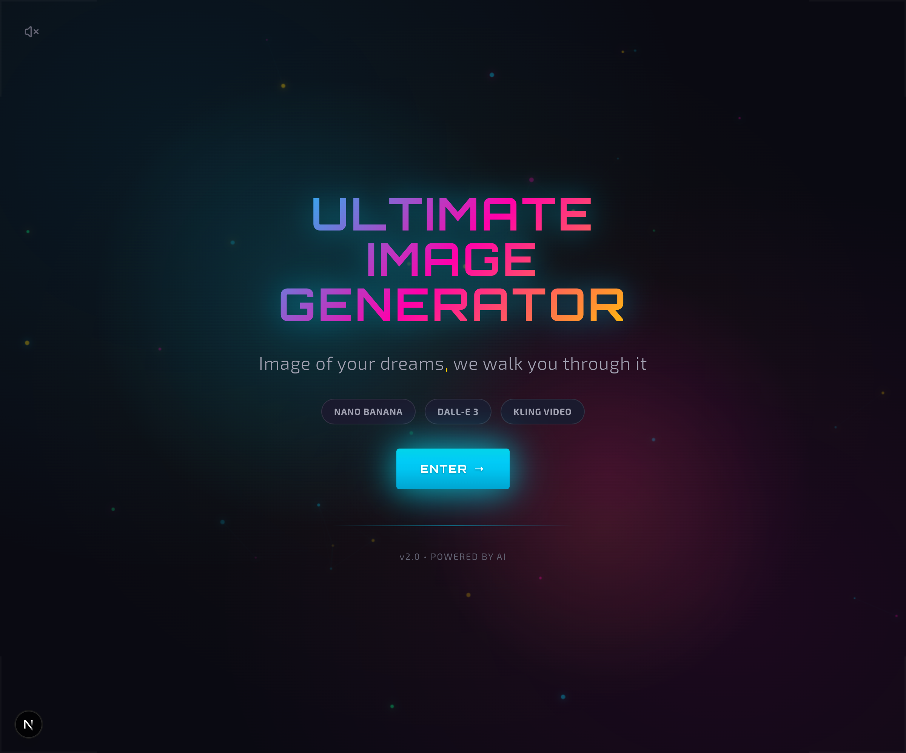
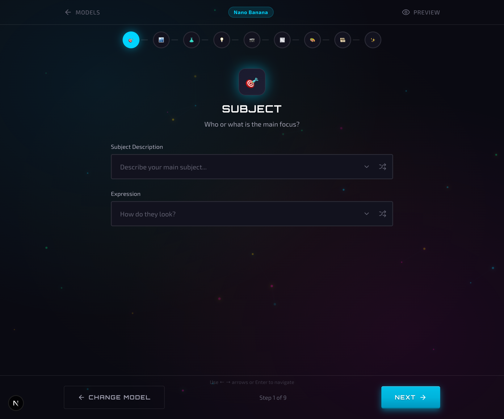
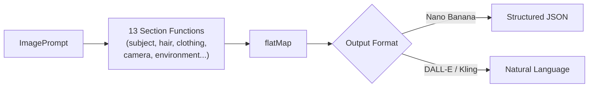
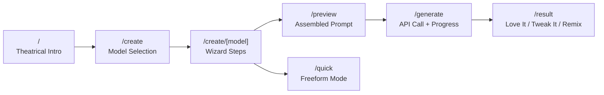

<div align="center">

# 🎬 Ultimate Image & Video Prompt Generator

**Craft hyper-detailed AI image and video prompts through a guided wizard — on the web or in your terminal.**

A dual-platform prompt builder with a Flash Site Era (2002-2006) aesthetic that turns prompt engineering from guesswork into a guided creative process.

**[🚀 Try the Live Demo](https://web-ten-vert-46.vercel.app)** · [Report Bug](https://github.com/DareDev256/Ultimate-Image-Video-Prompt-Generator/issues) · [Request Feature](https://github.com/DareDev256/Ultimate-Image-Video-Prompt-Generator/issues)


</div>

---

| Landing Page | Model Selection | Wizard |
|:---:|:---:|:---:|
|  |  |  |

## Quick Start

```bash
# Web app (no API key needed — free tier included)
git clone https://github.com/DareDev256/Ultimate-Image-Video-Prompt-Generator.git
cd Ultimate-Image-Video-Prompt-Generator/web && npm install && npm run dev

# CLI tool
cd Ultimate-Image-Video-Prompt-Generator && bun install && bun run index.ts
```

Open [localhost:3000](http://localhost:3000) and start generating — the free tier gives you 10 Nano Banana generations per day, no key required.

## Why This Exists

Most AI image tools give you a blank text box and wish you luck. This project solves that with **guided prompt engineering** — walking you through 13 categories (subject, camera, lighting, atmosphere, etc.) with curated suggestions for each field, then assembling everything into the exact format your chosen model expects.

The result: prompts that are 10× more detailed than what you'd write freehand, produced in a fraction of the time.

## Two Platforms, One Pipeline

### 🌐 Web App — Visual Wizard

A step-by-step guided experience with theatrical animations, particle effects, and a neon UI. Choose your model, walk through 9-11 categories, preview your assembled prompt, and generate — all in the browser.

### ⌨️ CLI Tool — Terminal Power

An interactive terminal interface for rapid prompt building with presets, templates, favorites, and image-to-prompt reverse engineering. Built on Bun with `@clack/prompts`.

```bash
bun run index.ts                          # Interactive wizard
bun run index.ts --analyze photo.png      # Reverse-engineer a prompt from an image
bun run index.ts --template "Subway Flash" # Start from a built-in template
bun run index.ts --preset fashion         # Use a category pack
bun run index.ts --favorites list         # Manage favorite suggestions
```

## Features

### 🎯 Guided Prompt Building

- **13 deep categories** with 3-7 fields each — Subject, Camera, Fashion, Environment, Lighting, Atmosphere, Composition, Color, Film, Technical, Vibes, and more
- **Curated suggestions** per field (8-10 hyper-specific options like "six thick rope braids radiating outward from skull")
- **Randomize** button for instant inspiration
- **Keyboard navigation** with smart focus detection

### 🤖 Multi-Model Generation

| Model | Type | Prompt Format | Free Tier |
|-------|------|--------------|-----------|
| **Nano Banana** (Gemini) | Image | Structured JSON | ✅ 10/day |
| **DALL-E 3** (OpenAI) | Image | Natural language | BYOK only |
| **Kling** | Video (5s/10s) | Natural language | BYOK only |

- **Free Tier** — Try Nano Banana without an API key (10 generations/day, server-side Gemini)
- **BYOK** — Bring Your Own Keys for unlimited use (keys stored in `localStorage` only)

### 💡 Inspiration Gallery

- **1,180+ curated image prompts** from the community
- **50+ video prompts** for Veo3/Kling/Hailuo
- Search and filter by tags (fashion, portrait, 3D, anime, etc.)
- **"Use as Template"** to pre-fill the wizard from any community prompt
- **Pattern library** — extracted lighting setups, camera angles, moods, and styles

### 🎨 Generation Flow

- Live preview of assembled prompt (JSON or natural language depending on model)
- Animated generation progress with theatrical transitions
- **Love It / Tweak It / Remix** result actions
- Gallery to save and revisit creations
- 30 pre-generated **Showcase** examples

### 💰 API Key Pricing

| Model | Provider | Cost per Image | Get a Key |
|-------|----------|---------------|-----------|
| Nano Banana | Google Gemini | ~$0.03 | [ai.google.dev](https://ai.google.dev/tutorials/setup) |
| DALL-E 3 | OpenAI | ~$0.04–0.12 | [platform.openai.com](https://platform.openai.com/api-keys) |
| Kling | Kling AI | Varies | [klingai.com](https://klingai.com) |

## Tech Stack

| Layer | Web App | CLI |
|-------|---------|-----|
| Framework | Next.js 16 (App Router) | Bun runtime |
| Language | TypeScript 5 | TypeScript 5 |
| Styling | Tailwind CSS v4 | picocolors |
| Animations | Framer Motion 12 | — |
| UI | React 19 + Lucide icons | @clack/prompts |
| State | React Context + localStorage | File-based (JsonStore) |
| APIs | Gemini, OpenAI, Kling | Gemini Vision (analyzer) |

## Getting Started

### Prerequisites

- **Node.js 18+** (web) or **Bun** (CLI + web)
- API keys are optional — the free tier works out of the box:
  - [Google AI Studio](https://ai.google.dev/tutorials/setup) — Gemini / Nano Banana
  - [OpenAI Platform](https://platform.openai.com/api-keys) — DALL-E 3
  - [Kling AI](https://klingai.com) — Video

### Web App

```bash
git clone https://github.com/DareDev256/Ultimate-Image-Video-Prompt-Generator.git
cd Ultimate-Image-Video-Prompt-Generator/web
npm install
npm run dev
```

Open [http://localhost:3000](http://localhost:3000). Configure API keys at `/settings` or just try the free tier.

### CLI Tool

```bash
cd Ultimate-Image-Video-Prompt-Generator
bun install
bun run index.ts
```

### Environment Variables

| Variable | Required | Scope | Description |
|----------|----------|-------|-------------|
| `GEMINI_API_KEY` | No | Server | Enables the free tier (10 generations/day) for users without their own keys |

User-provided API keys (Gemini, OpenAI, Kling) are entered in the browser at `/settings` and stored in `localStorage` only — they never touch the server.

### Deploy Your Own

[](https://vercel.com/new/clone?repository-url=https://github.com/DareDev256/Ultimate-Image-Video-Prompt-Generator&root-directory=web)

```bash
# Or manually
cd web && npm run build && npx vercel --prod
```

Add `GEMINI_API_KEY` as an environment variable in Vercel to enable the free tier for your users.

## Architecture

### Composable Section Pipeline

The prompt generator uses a **functional pipeline** where each prompt section is an independent pure function:



Sections can be composed, reordered, or extended without touching other sections. The natural language generator is just **18 lines** — a `flatMap` over the section array.

### Web App Page Flow



State persists across all page transitions via React Context + localStorage sync, surviving Framer Motion route animations.

### Inline Documentation

All types, section generators, and output formatters are documented with TSDoc — including `@example` blocks, `{@link}` cross-references, and field-level descriptions for every property in the `ImagePrompt` type tree.

## Project Structure

```
.
├── web/                          # Next.js web app
│   ├── src/
│   │   ├── app/
│   │   │   ├── page.tsx          # Theatrical intro screen
│   │   │   ├── create/           # Model selection → wizard → preview → generate → result
│   │   │   ├── gallery/          # Saved creations
│   │   │   ├── showcase/         # 30 pre-generated examples
│   │   │   ├── settings/         # API key configuration
│   │   │   └── api/generate/     # API routes (nano-banana, openai, kling)
│   │   ├── components/
│   │   │   ├── wizard/           # WizardStep, WizardProgress
│   │   │   ├── effects/          # Canvas particle system
│   │   │   └── inspiration/      # Gallery panel, search, filters, cards
│   │   ├── context/              # WizardContext (state + persistence), SoundContext
│   │   ├── hooks/                # useLocalStorage, useFavorites, useFreeTier, useInspirationData
│   │   └── lib/                  # Categories, sounds
│   └── public/data/              # Prompt library, patterns, showcase metadata
│
├── src/                          # CLI tool (Bun)
│   ├── index.ts                  # Entry point with arg parsing
│   ├── analyzer/                 # Gemini Vision — reverse-engineer prompts from images
│   ├── cli/                      # Terminal UI (prompts, display, menus, args)
│   ├── core/                     # 13 categories (1,019 lines), preset packs, templates
│   ├── generators/               # Composable section pipeline
│   │   ├── sections.ts           # 13 pure section generators
│   │   ├── natural.ts            # Natural language assembly (flatMap pipeline)
│   │   └── json.ts               # JSON output with recursive cleanup
│   ├── lib/                      # Shared utilities
│   │   └── json-store.ts         # Generic typed JSON file storage
│   ├── storage/                  # Config, presets, favorites (via JsonStore)
│   └── types/                    # ImagePrompt interface (12 nested types)
│
├── scripts/                      # Data pipeline (fetch, extract, translate, generate)
└── docs/                         # Design documents and plans
```

## Testing

```bash
bun test
```

**248 tests** across 12 test files:

| Module | Tests | Coverage |
|--------|-------|----------|
| Section generators | 56 | All 13 pure functions — edge cases, dedup, fallback precedence |
| Category data integrity | 16 | Unique names/emojis, field keys, suggestion validity |
| CLI argument parser | 22 | All 15 flags, shorthands, pack splitting, subcommands |
| JsonStore persistence | 11 | File I/O, defaults, deep-clone isolation, roundtripping |
| Pack/template registry | 18 | Composition, dedup, always-core invariant, uniqueness |
| Display text wrapping | 11 | Word boundaries, unicode, edge cases |
| Gemini analyzer | 14 | Error paths, MIME detection, markdown stripping |
| Prompt building | — | Ordering, nesting cleanup, unicode, JSON/NL consistency |

## Design Philosophy

This project embraces the **Flash Site Era** aesthetic (2002-2006) — when websites were *experiences*, not just pages:

- **Theatrical Loading** — Animated intro with progress bar and skip option
- **Glossy Everything** — Buttons with gradients, shadows, and glow effects
- **Particle Systems** — Canvas-based floating particles with GPU acceleration
- **Sound Design** — Optional click sounds and transitions
- **Over-the-top Transitions** — Page slides, scale animations, staggered reveals
- **Neon Palette** — Cyan `#00d4ff`, pink `#ff00aa`, green `#00ff88`, gold `#ffd700`
- **Typography** — Orbitron (headings) + Exo 2 (body)

## Challenges & Solutions

| Challenge | Solution |
|-----------|----------|
| **State loss during page transitions** | Framer Motion unmounts components on route change. Solved with React Context + localStorage sync to persist wizard state across animated transitions. |
| **Keyboard nav vs. text input** | Arrow keys conflicted with suggestion field typing. Implemented focus detection to disable shortcuts during input, re-enable on blur. |
| **Canvas particle performance** | Frame drops on lower-end devices. Reduced particle count, added `requestAnimationFrame` throttling and `will-change` GPU hints. |
| **Multi-model prompt formats** | Each AI model expects different formats. Built a unified generation interface with model-specific adapters (JSON for Nano Banana, natural language for DALL-E/Kling). |

## Privacy & Security

- API keys stored in `localStorage` only — **never sent to any server**
- No server-side storage of prompts or images
- Direct API calls from your browser (except free tier)
- Server-side input validation: prompt length limits, control character stripping, API key format checks
- Rate limiting on free tier (10 generations/day per client)

## Community Prompts Attribution

The Inspiration Gallery includes curated prompts from [@songguoxs](https://github.com/songguoxs):

- **[gpt4o-image-prompts](https://github.com/songguoxs/gpt4o-image-prompts)** — 1,180+ curated image prompts
- **[awesome-video-prompts](https://github.com/songguoxs/awesome-video-prompts)** — 50+ Veo3/Kling video prompts

## Contributing

See [CONTRIBUTING.md](./CONTRIBUTING.md) for guidelines. Bug reports, feature suggestions, and pull requests are welcome.

## License

[MIT](./LICENSE)

---

<div align="center">

Built with caffeine and nostalgia for the early 2000s web.

**[⬆ Back to Top](#-ultimate-image--video-prompt-generator)**

</div>
