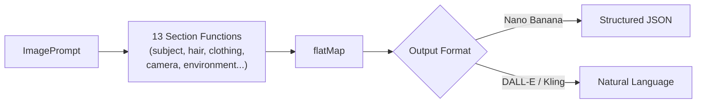
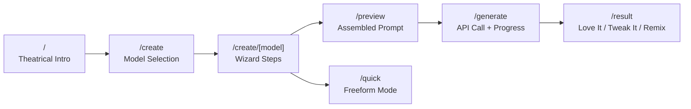

<div align="center">

# 🎬 Ultimate Image & Video Prompt Generator

**Craft hyper-detailed AI image and video prompts through a guided wizard — on the web or in your terminal.**

A dual-platform prompt builder with a Flash Site Era (2002–2006) aesthetic that turns prompt engineering from guesswork into a guided creative process. Neon UI. Particle effects. 13 categories of curated suggestions. Zero blank-box anxiety.

**[🚀 Try the Live Demo](https://web-ten-vert-46.vercel.app)** · [Report Bug](https://github.com/DareDev256/Ultimate-Image-Video-Prompt-Generator/issues) · [Request Feature](https://github.com/DareDev256/Ultimate-Image-Video-Prompt-Generator/issues)


</div>

---

### At a Glance

| | |
|---|---|
| **13 guided categories** — subject, camera, lighting, atmosphere, composition, color, film, vibes… | **7,000+ curated prompts** — community-sourced inspiration library with search & filters |
| **3 AI models** — Nano Banana (free tier), DALL-E 3, Kling video | **417 tests / 2,144 assertions** — every generator, every invariant, zero `any` types |
| **2 platforms** — visual web wizard + interactive CLI with presets & templates | **240 extracted patterns** — lighting rigs, camera angles, moods, color grades, styles |

---

| Theatrical Intro | Model Selection | Guided Wizard |
|:---:|:---:|:---:|
|  |  |  |

## Table of Contents

- [Quick Start](#quick-start)
- [How It Works](#how-it-works)
- [Why This Exists](#why-this-exists)
- [Two Platforms, One Pipeline](#two-platforms-one-pipeline)
- [Features](#features)
- [Tech Stack](#tech-stack)
- [Getting Started](#getting-started)
- [Architecture](#architecture)
- [Testing](#testing)
- [Engineering Highlights](#engineering-highlights)
- [Design Philosophy](#design-philosophy)
- [Privacy & Security](#privacy--security)
- [Data Pipeline](#data-pipeline)
- [Documentation](#documentation)
- [Contributing](#contributing)

## Quick Start

```bash
# Web app (no API key needed — free tier included)
git clone https://github.com/DareDev256/Ultimate-Image-Video-Prompt-Generator.git
cd Ultimate-Image-Video-Prompt-Generator/web && npm install && npm run dev

# CLI tool
cd Ultimate-Image-Video-Prompt-Generator && bun install && bun run index.ts
```

Open [localhost:3000](http://localhost:3000) and start generating — the free tier gives you 10 Nano Banana generations per day, no key required.

## How It Works

```
┌─────────────────┐     ┌──────────────────────┐     ┌─────────────────────┐
│  1. CHOOSE       │     │  2. BUILD             │     │  3. GENERATE         │
│                  │     │                       │     │                      │
│  Pick your AI    │ ──▸ │  Walk through 13      │ ──▸ │  One click sends     │
│  model: Nano     │     │  guided categories    │     │  your assembled      │
│  Banana, DALL-E  │     │  with curated         │     │  prompt to the API   │
│  3, or Kling     │     │  suggestions per      │     │  and returns your    │
│                  │     │  field                │     │  generated image     │
└─────────────────┘     └──────────────────────┘     └─────────────────────┘
```

> **Quick Mode** — Don't want to fill every field? Describe your idea in one sentence and let AI expand it into a full 13-category prompt automatically.

## Why This Exists

Most AI image tools give you a blank text box and wish you luck. This project solves that with **guided prompt engineering** — walking you through 13 categories (subject, camera, lighting, atmosphere, etc.) with curated suggestions for each field, then assembling everything into the exact format your chosen model expects.

The result: prompts that are 10× more detailed than what you'd write freehand, produced in a fraction of the time.

### What Makes This Different

Most prompt tools are either a glorified text box or a rigid template picker. This project sits in between — **structured enough to guide you, flexible enough to not constrain you**:

- **Diversity-aware randomization** — a sliding-window exclusion algorithm (not naive `Math.random()`) ensures the "randomize" button always surfaces fresh suggestions. [Algorithm deep-dive →](#diversity-aware-randomization)
- **Model-aware output** — the same wizard produces structured JSON for Gemini or natural language for DALL-E/Kling, automatically adapting to what each model expects
- **Composable architecture** — 13 pure section generators composed via `flatMap`. Adding a new prompt category is one function + one array entry, zero touch points elsewhere
- **Actually tested** — 417 tests prove invariants like "NL and JSON generators stay in sync on the same input" and "the randomizer never deadlocks regardless of pool size"

## Two Platforms, One Pipeline

### 🌐 Web App — Visual Wizard

A step-by-step guided experience with theatrical animations, particle effects, and a neon UI. Choose your model, walk through 9-11 categories, preview your assembled prompt, and generate — all in the browser.

### ⌨️ CLI Tool — Terminal Power

An interactive terminal interface for rapid prompt building with presets, templates, favorites, and image-to-prompt reverse engineering. Built on Bun with `@clack/prompts`.

```bash
bun run index.ts                          # Interactive wizard
bun run index.ts --analyze photo.png      # Reverse-engineer a prompt from an image
bun run index.ts --template "Subway Flash" # Start from a built-in template
bun run index.ts --preset fashion         # Use a category pack
bun run index.ts --favorites list         # Manage favorite suggestions
```

## Features

### 🎯 Guided Prompt Building

- **13 deep categories** with 3-7 fields each — Subject, Camera, Fashion, Environment, Lighting, Atmosphere, Composition, Color, Film, Technical, Vibes, and more
- **Curated suggestions** per field (8-10 hyper-specific options like "six thick rope braids radiating outward from skull")
- **Quick Mode** — describe your idea in plain English, AI expands to full structured prompt
- **Diversity-aware Randomize** — sliding-window exclusion algorithm tracks recent picks per field so consecutive clicks always surface fresh suggestions (see [algorithm detail](#diversity-aware-randomization))
- **Keyboard navigation** with smart focus detection

### 🤖 Multi-Model Generation

| Model | Type | Prompt Format | Free Tier | Notes |
|-------|------|--------------|-----------|-------|
| **Nano Banana** (Gemini) | Image | Structured JSON | ✅ 10/day | Instant response |
| **DALL-E 3** (OpenAI) | Image | Natural language | BYOK only | Returns AI-revised prompt alongside your image |
| **Kling** | Video (5s/10s) | Natural language | BYOK only | Async polling — generates in up to 5 min |

- **Free Tier** — Try Nano Banana without an API key (10 generations/day, server-side Gemini)
- **BYOK** — Bring Your Own Keys for unlimited use (keys stored in `localStorage` only)
- **Kling video generation** uses a two-phase async pattern: POST to create task → poll every 5s until complete. Supports 16:9, 9:16, and 1:1 aspect ratios

### 💡 Inspiration Gallery & Showcase

- **1,180+ curated image prompts** from the community + **5,600+ Nano Banana prompts**
- **50+ video prompts** for Veo3/Kling/Hailuo
- Search and filter by tags (fashion, portrait, 3D, anime, etc.)
- **"Use as Template"** to pre-fill the wizard from any community prompt
- **Pattern library** — 240 extracted patterns across lighting, cameras, moods, color grades, and styles
- **Showcase** — 30 editorially curated examples with full 13-category prompt breakdowns and image carousels

### 🎨 Generation Flow

- Live preview of assembled prompt (JSON or natural language depending on model)
- Animated generation progress with theatrical transitions
- **Love It / Tweak It / Remix** result actions
- Gallery to save and revisit creations
- 30 pre-generated **Showcase** examples + 113 AI-generated community examples

### 💰 API Key Pricing

| Model | Provider | Cost per Image | Get a Key |
|-------|----------|---------------|-----------|
| Nano Banana | Google Gemini | ~$0.03 | [ai.google.dev](https://ai.google.dev/tutorials/setup) |
| DALL-E 3 | OpenAI | ~$0.04–0.12 | [platform.openai.com](https://platform.openai.com/api-keys) |
| Kling | Kling AI | Varies | [klingai.com](https://klingai.com) |

## Tech Stack

| Layer | Web App | CLI |
|-------|---------|-----|
| Framework | Next.js 16 (App Router) | Bun runtime |
| Language | TypeScript 5 | TypeScript 5 |
| Styling | Tailwind CSS v4 | picocolors |
| Animations | Framer Motion 12 | — |
| UI | React 19 + Lucide icons | @clack/prompts |
| State | React Context + localStorage | File-based (JsonStore) |
| APIs | Gemini, OpenAI, Kling | Gemini Vision (analyzer) |

## Getting Started

### Prerequisites

- **Node.js 18+** (web) or **Bun** (CLI + web)
- API keys are optional — the free tier works out of the box:
  - [Google AI Studio](https://ai.google.dev/tutorials/setup) — Gemini / Nano Banana
  - [OpenAI Platform](https://platform.openai.com/api-keys) — DALL-E 3
  - [Kling AI](https://klingai.com) — Video

### Web App

```bash
git clone https://github.com/DareDev256/Ultimate-Image-Video-Prompt-Generator.git
cd Ultimate-Image-Video-Prompt-Generator/web
npm install
npm run dev
```

Open [http://localhost:3000](http://localhost:3000). Configure API keys at `/settings` or just try the free tier.

### CLI Tool

```bash
cd Ultimate-Image-Video-Prompt-Generator
bun install
bun run index.ts
```

### Environment Variables

| Variable | Required | Scope | Description |
|----------|----------|-------|-------------|
| `GEMINI_API_KEY` | No | Server | Enables the free tier (10 generations/day) for users without their own keys |

User-provided API keys (Gemini, OpenAI, Kling) are entered in the browser at `/settings` and stored in `localStorage` only — they never touch the server.

### Deploy Your Own

[](https://vercel.com/new/clone?repository-url=https://github.com/DareDev256/Ultimate-Image-Video-Prompt-Generator&root-directory=web)

```bash
# Or manually
cd web && npm run build && npx vercel --prod
```

Add `GEMINI_API_KEY` as an environment variable in Vercel to enable the free tier for your users.

## Architecture

### Composable Section Pipeline

The prompt generator uses a **functional pipeline** where each prompt section is an independent pure function:



Sections can be composed, reordered, or extended without touching other sections. The natural language generator is just **18 lines** — a `flatMap` over the section array.

### Web App Page Flow



State persists across all page transitions via React Context + localStorage sync, surviving Framer Motion route animations.

### Diversity-Aware Randomization

Most "randomize" buttons use naive `Math.random()` — click three times, get the same suggestion twice. This project uses a **sliding-window exclusion algorithm** inspired by shuffle-play systems:

```
Click 1: pool=[A,B,C,D,E] recent=[]       → picks C → recent=[C]
Click 2: pool=[A,B,D,E]   recent=[C]      → picks A → recent=[C,A]
Click 3: pool=[B,D,E]     recent=[C,A]    → picks E → recent=[C,A,E]
Click 4: pool=[B,D]       recent=[C,A,E]  → picks D → recent=[C,A,E,D]
Click 5: pool=[B]          recent=[C,A,E,D]→ picks B → recent=[A,E,D,B]  ← window slides
Click 6: pool=[C]          recent=[A,E,D,B]→ picks C → recent=[E,D,B,C]  ← C is fresh again
```

**Graceful fallback**: when every option is in the recent window (small pools), exclusion is skipped and the full pool is used — the algorithm never deadlocks regardless of pool size vs window size.

| Layer | File | Role |
|-------|------|------|
| Pure algorithm | `web/src/lib/diverse-pick.ts` | `diversePick`, `pushRecent`, `buildRandomPrompt`, `flattenPromptToText`, `PickableField`, `PickableCategory` — zero React dependencies, fully testable with exported type contracts |
| React binding | `web/src/hooks/useDiversePick.ts` | `useDiversePick<T>` hook — per-field-key recent tracking via `useRef` |
| Wizard integration | `WizardStep.tsx` | Per-field randomize button |
| Quick Mode integration | Quick Mode page | Full-prompt randomization via `buildRandomPrompt` composed with the hook's picker |

Both the wizard and Quick Mode share the identical algorithm — Quick Mode composes `buildRandomPrompt` with the hook's picker function for zero-duplication prompt assembly across all 13 categories in a single click.

<details>
<summary><strong>Proven properties (35 tests)</strong></summary>

| Property | What the tests prove |
|----------|---------------------|
| **Exclusion correctness** | When alternatives exist, items in the recent window are never picked |
| **Graceful degradation** | When every option is recent (or recent is a superset), the algorithm falls back to the full pool — never deadlocks |
| **Type generality** | Works with strings, numbers, and frozen `readonly` arrays without mutation |
| **Statistical diversity** | Over 100 picks from 5 options, at least 3 distinct values appear (probabilistic smoke test) |
| **Window sliding** | `pushRecent` trims to `maxSize`, preserves immutability, handles edge windows (size=1, size=100) |
| **Integration** | Sliding window + picker composed together: no 3 consecutive identical picks over 12-round sequences |
| **Key derivation** | `buildRandomPrompt` derives output keys from field key prefixes (not category IDs), falling back to `category.id` only for empty categories |
| **Round-trip fidelity** | `buildRandomPrompt → flattenPromptToText` preserves all non-empty values through the pipeline, including unicode |

</details>

### Input Validation & Sanitization

All three API routes (`/api/generate/nano-banana`, `openai`, `kling`) share a centralized validation layer (`web/src/lib/validation.ts`):

- Prompt length limit (10,000 chars) to prevent oversized payloads
- Control character stripping (null bytes, C0/C1 range)
- API key format validation (alphanumeric + limited special chars, max 256 chars)
- Upstream error sanitization — third-party error details are never leaked to the client

### Inline Documentation

All types, section generators, and output formatters are documented with TSDoc — including `@example` blocks, `{@link}` cross-references, and field-level descriptions for every property in the `ImagePrompt` type tree.

<details>
<summary><strong>📁 Project Structure</strong></summary>

```
.
├── .todoignore                   # Excludes node_modules etc. from code-debt scanning
├── web/                          # Next.js web app
│   ├── src/
│   │   ├── app/
│   │   │   ├── page.tsx          # Theatrical intro screen
│   │   │   ├── create/           # Model selection → wizard → preview → generate → result
│   │   │   ├── gallery/          # Saved creations
│   │   │   ├── showcase/         # 30 pre-generated examples
│   │   │   ├── settings/         # API key configuration
│   │   │   └── api/generate/     # API routes (nano-banana, openai, kling)
│   │   ├── components/
│   │   │   ├── wizard/           # WizardStep, WizardProgress
│   │   │   ├── effects/          # Canvas particle system
│   │   │   └── inspiration/      # Gallery panel, search, filters, cards
│   │   ├── context/              # WizardContext (state + persistence), SoundContext
│   │   ├── hooks/                # useLocalStorage, useDiversePick, useFavorites, useFreeTier, usePatterns, useInspirationData
│   │   └── lib/                  # Categories, diverse-pick, validation, sounds
│   └── public/data/              # Prompt library, patterns, showcase metadata
│
├── src/                          # CLI tool (Bun)
│   ├── index.ts                  # Entry point with arg parsing
│   ├── analyzer/                 # Gemini Vision — reverse-engineer prompts from images
│   ├── cli/                      # Terminal UI (prompts, display, menus, args)
│   ├── core/                     # 13 categories (1,019 lines), preset packs, templates
│   ├── generators/               # Composable section pipeline
│   │   ├── sections.ts           # 13 pure section generators
│   │   ├── natural.ts            # Natural language assembly (flatMap pipeline)
│   │   └── json.ts               # JSON output with recursive cleanup
│   ├── lib/                      # Shared utilities
│   │   ├── json-store.ts         # Generic typed JSON file storage
│   │   └── nested.ts             # Dot-notation path traversal utilities
│   ├── storage/                  # Config, presets, favorites (via JsonStore)
│   └── types/                    # ImagePrompt interface (12 nested types)
│
├── scripts/                      # Data pipeline (fetch, extract, translate, generate)
└── docs/                         # Design documents and plans
```

</details>

## Testing

```bash
bun test
```

**417 tests** across 17 test files:

| Module | Tests | Coverage |
|--------|-------|----------|
| Section generators | 56 | All 13 pure functions — edge cases, dedup, fallback precedence |
| Template→pipeline integration | 36 | Every template through NL+JSON generators, merge behavior, data integrity |
| Diversity-aware randomization | 59 | `diversePick` exclusion, full-pool fallback, superset recent, statistical diversity proof, **probabilistic fairness (distribution sanity)**, **pigeonhole coverage guarantee**, reference equality semantics for objects, duplicate filtering, large pool (1000 opts), `pushRecent` sliding window + immutability + `maxSize=0`/negative boundary, `buildRandomPrompt` key derivation (single-segment, multi-dot, prefix collision), **empty-suggestions contract propagation**, **field iteration order**, **mixed empty/populated categories**, `flattenPromptToText` empty/unicode/**whitespace-only**/insertion-order handling, window eviction proof, per-field history isolation, build→flatten round-trip with diversity picker, **full-cycle multi-category simulation** |
| Cross-cutting invariants | 24 | NL/JSON consistency, cleanObject edge cases, pipeline purity, parseArgs boundaries |
| CLI argument parser | 22 | All 15 flags, shorthands, pack splitting, subcommands |
| Input validation & sanitization | 22 | Prompt length/type/control-char stripping, API key format/injection defense |
| Pack/template registry | 18 | Composition, dedup, always-core invariant, uniqueness |
| Category data integrity | 16 | Unique names/emojis, field keys, suggestion validity |
| Gemini analyzer | 14 | Error paths, MIME detection, markdown stripping |
| Nested path utilities | 13 | Dot-notation get/set, missing paths, intermediate creation |
| Display text wrapping | 11 | Word boundaries, unicode, edge cases |
| JsonStore persistence | 11 | File I/O, defaults, deep-clone isolation, roundtripping |
| Prompt building | — | Ordering, nesting cleanup, unicode, JSON/NL consistency |

## Engineering Highlights

Things I'm particularly proud of in this codebase:

| Area | What | Why it matters |
|------|------|----------------|
| **Zero `any` types** | Entire codebase uses `unknown` at serialization boundaries with type narrowing | Catches bugs at compile time that `any` would silently pass through — especially in the JSON serializer where nested data arrives as `unknown` |
| **Composable pipeline** | 13 section generators are pure functions composed via `flatMap` | Adding a new prompt section is one function + one array entry — no touch points in existing code |
| **Diversity-aware randomization** | Sliding-window exclusion algorithm ([detail](#diversity-aware-randomization)) shared between wizard and Quick Mode | Pure function `diversePick` + `buildRandomPrompt` + `flattenPromptToText` with exported `PickableField`/`PickableCategory` interfaces — 59 tests prove exclusion, graceful degradation, probabilistic fairness, pigeonhole coverage, reference equality semantics, key derivation, window eviction, and round-trip fidelity ([proven properties](#diversity-aware-randomization)) |
| **Centralized input validation** | Shared `validation.ts` with prompt sanitization, key format checks, and length limits | One place to audit, one place to fix — not scattered across 3 API routes |
| **Single-source model registry** | `MODEL_NAMES`, `MODEL_COLORS`, `isValidModel` in `lib/models.ts` + `useCopyToClipboard` hook | Adding a model or changing brand colors is a 1-file change — replaces 4× duplicated metadata maps and 3× clipboard boilerplate |
| **Data-driven preset parsing** | Replaced 5-branch `else if` chain with a `PRESET_FLAGS` lookup map | Adding a new preset is a one-line map entry instead of a new branch |
| **417 tests / 2,144 assertions** | Every generator, every template, every CLI flag, cross-format consistency checks, web-side validation & diversity logic | Not just coverage — tests document *invariants* like "NL and JSON generators stay in sync on the same input" |

## Design Philosophy

This project embraces the **Flash Site Era** aesthetic (2002-2006) — when websites were *experiences*, not just pages:

- **Theatrical Loading** — Animated intro with progress bar and skip option
- **Glossy Everything** — Buttons with gradients, shadows, and glow effects
- **Particle Systems** — Canvas-based floating particles with GPU acceleration
- **Sound Design** — 5 named sounds (click, whoosh, hover, success, processing) — off by default, opt-in via settings, preference persisted in `localStorage`
- **Over-the-top Transitions** — Page slides, scale animations, staggered reveals
- **Neon Palette** — Cyan `#00d4ff`, pink `#ff00aa`, green `#00ff88`, gold `#ffd700`
- **Typography** — Orbitron (headings) + Exo 2 (body)

<details>
<summary><strong>🧩 Challenges & Solutions</strong></summary>

| Challenge | Solution |
|-----------|----------|
| **State loss during page transitions** | Framer Motion unmounts components on route change. Solved with React Context + localStorage sync to persist wizard state across animated transitions. |
| **Keyboard nav vs. text input** | Arrow keys conflicted with suggestion field typing. Implemented focus detection to disable shortcuts during input, re-enable on blur. |
| **Canvas particle performance** | Frame drops on lower-end devices. Reduced particle count, added `requestAnimationFrame` throttling and `will-change` GPU hints. |
| **Multi-model prompt formats** | Each AI model expects different formats. Built a unified generation interface with model-specific adapters (JSON for Nano Banana, natural language for DALL-E/Kling). |
| **Randomize repeats same values** | Naive `Math.random()` frequently repeats the same suggestion. Implemented a [sliding-window exclusion algorithm](#diversity-aware-randomization) (`diversePick`) that tracks recent picks per field and excludes them from the candidate pool — with graceful fallback when the pool is smaller than the window. |
| **Type safety at serialization boundaries** | `cleanObject` recursively processes prompt data of unknown shape. Replaced `any` with `unknown` + type narrowing to catch bugs at compile time instead of runtime. |

</details>

## Privacy & Security

- API keys stored in `localStorage` only — **never sent to any server**
- No server-side storage of prompts or images
- Direct API calls from your browser (except free tier)
- Server-side input validation: prompt length limits, control character stripping, API key format checks
- Rate limiting on free tier (10 generations/day per client)
- **HTTP security headers** on all routes: HSTS, X-Frame-Options (DENY), X-Content-Type-Options, Referrer-Policy, Permissions-Policy
- Upstream API errors are sanitized — third-party error details are never leaked to the client

## Data Pipeline

The `scripts/` directory contains a full pipeline for refreshing and expanding the prompt library:

| Script | What it does |
|--------|-------------|
| `fetch-prompts.ts` | Fetches image + video prompts from upstream repos |
| `fetch-nano-banana-prompts.ts` | Fetches 5,600+ prompts from YouMind-OpenLab |
| `extract-patterns.ts` | Mines the corpus to build 240 patterns (lighting, cameras, moods, etc.) |
| `translate-titles.ts` | Extracts English titles from bilingual EN/ZH content |
| `batch-generate-inspiration.py` | Batch-generates preview images via Gemini 3 Pro |
| `update-prompts-with-generated.py` | Writes generated image paths back into prompt JSON |

```
fetch → translate → extract patterns → generate images → update JSON
```

## Community Prompts Attribution

The Inspiration Gallery includes curated prompts from:

- **[@songguoxs](https://github.com/songguoxs)**: [gpt4o-image-prompts](https://github.com/songguoxs/gpt4o-image-prompts) (1,180+ image prompts) · [awesome-video-prompts](https://github.com/songguoxs/awesome-video-prompts) (50+ video prompts)
- **[@YouMind-OpenLab](https://github.com/YouMind-OpenLab)**: [awesome-nano-banana-pro-prompts](https://github.com/YouMind-OpenLab/awesome-nano-banana-pro-prompts) (5,600+ Nano Banana prompts)

## Documentation

- **[API Reference](./docs/API.md)** — Generation endpoints, CLI commands, validation rules, and error codes
- **[Diversity-Aware Randomization](./docs/diversity-picking.md)** — Algorithm deep-dive, 4-layer architecture, API reference, design decisions, and proven invariants
- **[Contributing Guide](./CONTRIBUTING.md)** — Code style, component patterns, and PR process

## Contributing

See [CONTRIBUTING.md](./CONTRIBUTING.md) for guidelines. Bug reports, feature suggestions, and pull requests are welcome.

## License

[MIT](./LICENSE)

---

<div align="center">

Built with caffeine and nostalgia for the early 2000s web by [DareDev256](https://github.com/DareDev256).

*Remember when websites had loading screens, particle effects, and sound design? This is that energy — with modern engineering underneath.*

**[⬆ Back to Top](#-ultimate-image--video-prompt-generator)**

</div>
